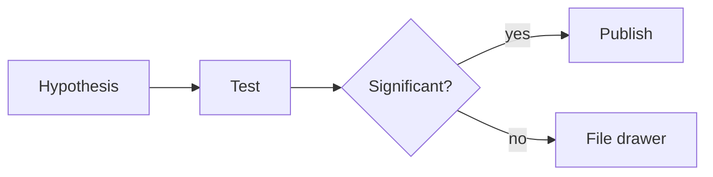

This file lives in `_drafts/` — preview locally, never deployed. Copy snippets into your real post.

**Preview:** `http://127.0.0.1:8080/blog/2026/formatting-cheat-sheet/` (Docker + `--drafts`).

---

## Front matter (top of every post)

```yaml
---
layout: post
title: Your title
date: 2026-07-04 12:00:00 -0400
description: One line for the blog index and search.
tags: [statistics, metascience]
categories: [metascience]
related_posts: true          # set false for short/reference posts
---
```

**Filename when published:** `_posts/YYYY-MM-DD-your-slug.md` (date in filename controls URL slug).

---

## Headings and text

# H1 — usually auto-generated from title; use ## inside the post

## Section

### Subsection

#### Smaller heading

Regular paragraph. **Bold**, *italic*, ***both***, ~~strikethrough~~, and `inline code`.

Line break: end a line with two spaces,  
or use a blank line between paragraphs.

---

## Links

[Link text](https://example.com)

[Link with title](https://example.com "hover tooltip")

Auto-link: <https://example.com>

Open in new tab (GFM): [external link](https://example.com){:target="_blank"}

---

## Lists

### Bulleted

- First item
- Second item
  - Nested item
  - Another nested item
- Back to top level

### Numbered

1. First step
2. Second step
   1. Sub-step a
   2. Sub-step b
3. Third step

### Task / checklist

- [x] Done
- [ ] Not done
- [ ] Nested tasks need extra indent
  - [x] Sub-task done

### Definition-style (useful for jargon)

Term one
: Definition of term one.

Term two
: Definition of term two.

---

## Blockquotes

Plain quote:

> This is a blockquote.
> It can span multiple lines.

Nested quote:

> Outer quote
>
> > Inner quote

Attribution style:

> We do not grow absolutely, chronologically. We grow sometimes in one dimension, and not in another.
>
> — Anais Nin

### Styled callouts (tip / warning / danger)

Add `{: .block-tip }` (or `-warning` / `-danger`) on the line **after** the blockquote.

> **FWER:** The probability that *one or more* claims of significance are false.
{: .block-tip }

> **WARNING:** This is easy to misuse if you skip the family definition.
{: .block-warning }

> **DANGER:** Do not interpret a significant *q*-value as proof the effect is real.
{: .block-danger }

You can also use a heading inside the callout:

> ##### TIP
>
> A tip can give advice related to the content.
{: .block-tip }

---

## Footnotes

Kramdown footnotes[^fn-example] work out of the box.

[^fn-example]: Footnote text goes at the bottom of the post (or inline).

---

## Code

Inline: `variable_name`, `p.adjust()`, `` `backticks` inside backticks ``.

Fenced block with syntax highlighting (Rouge):

```python
import pandas as pd

df = pd.read_csv("data.csv")
print(df.head())
```

```r
fit <- lm(y ~ x, data = dat)
summary(fit)
```

```bash
bundle exec jekyll serve --drafts --unpublished
```

### Code inside a list

Indent the fence **3 spaces** past the list marker:

1. Load the data.

   ```r
   dat <- read.csv("data.csv")
   ```

2. Fit the model.

   ```r
   fit <- lm(y ~ x, data = dat)
   ```

---

## Math (enabled on your site)

Inline: $P < 0.05$, $\alpha = 0.05$, $\hat{\beta}$.

Display (own paragraph):

$$
\hat{\beta} = (X^\top X)^{-1} X^\top y
$$

Numbered equation with reference:

\begin{equation}
\label{eq:fdr}
\mathrm{FDR} = \mathbb{E}\left[\frac{V}{R \vee 1}\right]
\end{equation}

Refer back with `\eqref{eq:fdr}` in the text (renders as equation number).

---

## Tables

### Simple markdown table

| Column A | Column B | Column C |
| :------- | :------: | -------: |
| left     |  center  |    right |
| foo      |   bar    |      baz |

### Interactive table

Add `pretty_table: true` to front matter, then use markdown or HTML tables. On your site (Tailwind mode, no Bootstrap compat), tables get search/sort/pagination.

---

## Table of contents

**At the top of the post:**

```yaml
toc:
  beginning: true
```

**Sticky sidebar while scrolling:**

```yaml
toc:
  sidebar: left    # or right
  collapse: auto   # or expanded
```

**Custom label in the TOC** (hide a long heading):

```markdown
## A very long heading that should look shorter in the sidebar

{:data-toc-text="Short label"}
```

---

## Figures and images

Put files in `assets/img/`. Prefer **one** profile-style basename per image (avoid `photo.jpg` and `photo.jpeg` — they collide when generating WebP).

### Single image with zoom

<div class="col-sm mt-3 mt-md-0">
  
</div>

### With caption

<div class="col-sm mt-3 mt-md-0">
  
</div>

### Two images side by side

<div class="row">
  <div class="col-sm mt-3 mt-md-0">
    
  </div>
  <div class="col-sm mt-3 mt-md-0">
    
  </div>
</div>

### Plain markdown image (no lightbox)


---

## Video

Local file:

<div class="row mt-3">
  <div class="col-sm mt-3 mt-md-0">
    
  </div>
</div>

YouTube embed:

<div class="row mt-3">
  <div class="col-sm mt-3 mt-md-0">
    
  </div>
</div>

---

## Audio

<div class="row mt-3">
  <div class="col-sm mt-3 mt-md-0">
    
  </div>
</div>

---

## Tabs

Add `tabs: true` to front matter.





```r
fit <- lm(y ~ x, data = dat)
summary(fit)
```





```python
import statsmodels.formula.api as smf
smf.ols("y ~ x", data=dat).fit().summary()
```





Syntax to copy:



```liquid



Content here.



```



---

## Mermaid diagrams

Add to front matter:

```yaml
mermaid:
  enabled: true
  zoomable: true
```

Then a fenced `mermaid` block:



---

## Charts (optional — needs front matter flags)

Example with Chart.js — add `chart: { chartjs: true }` to front matter:

````markdown
```chartjs
{
  "type": "bar",
  "data": {
    "labels": ["A", "B", "C"],
    "datasets": [{ "label": "Values", "data": [3, 7, 2] }]
  }
}
```
````

Similar patterns exist for ECharts, Plotly, etc. (see [al-folio demo posts](https://github.com/alshedivat/al-folio/tree/master/_posts)).

---

## Collapsible sections (HTML)

<details markdown="1">
<summary>Click to expand</summary>

Hidden content here. Markdown inside works when you add `markdown="1"`.

- Still a list
- Still **bold**

</details>

---

## Horizontal rule

---

## Emoji

jemoji is installed — use `:smile:`, `:+1:`, `:warning:`, etc. Or paste unicode directly: ⚠️ 📊.

---

## References (your preferred style)

Manual numbered list — no jekyll-scholar needed:

## References

1. Storey, J. D. (2003). The positive false discovery rate. *The Annals of Statistics*, *31*(6), 2013–2035.
2. Gelman, A., Hill, J., & Yajima, M. (2012). Why we (usually) don't have to worry about multiple comparisons. *Journal of Research on Educational Effectiveness*, *5*(2), 189–211.

In-text: `Storey [1]` or `see [2] for discussion`.

### Optional: jekyll-scholar (if you add entries to `_bibliography/papers.bib`)

Inline: `` · Bibliography at end: ``

---

## Raw Liquid / stop Markdown processing

Wrap Liquid examples you want to *show* without executing:



```liquid

```



Stop Kramdown from eating plugin tags:

```liquid
{::nomarkdown}

{:/nomarkdown}
```

---

## Distill posts (separate layout)

For long-form interactive articles, use `layout: distill` instead of `layout: post`. Different feature set — block callouts behave differently there. Your existing long posts use standard `layout: post`.

---

## Quick checklist before publishing

1. Move file to `_posts/YYYY-MM-DD-slug.md`
2. Set `date`, `title`, `description`, `tags`
3. Put images in `assets/img/` (no duplicate `.jpg` / `.jpeg` basenames)
4. Hard-refresh preview after image changes (WebP cache)
5. Push to `master` → GitHub Actions deploys (~5 min)

---

## Related draft files

| File | Use for |
|------|---------|
| `_drafts/text-post-draft.md` | Blank mostly-text post |
| `_drafts/post-template.md` | General post starter |
| `_drafts/code-and-figures-reference.md` | Shorter figures/code only |
